# Gerenciador de Estoque
### Código exemplo da aplicação desenvolvida em [QT](http://www.qt.io) para gerenciar o estoque de uma loja de eletrônica (Arduíno, sensores, etc).
#### Este código foi desenvolvido por EDER MADRUGA COELHO (20181610028) na disciplina de Técnicas de Programação (2018.2) tendo como base o código Gerenciador de alunos 2018.2 do professor PATRIC LACOUTH.

A aplicação deve permitir ao usuário a inserção de vários produtos da loja de eletrônica, mostrando-os em uma tabela (TableWidget), onde será possível a ordenação pelo Item (Produto) ou pela Quantidade. É possível que o usuário salve a Lista de Produtos em um arquivo de texto (.txt) ou que o mesmo carregue essa lista de um arquivo. Além disso é permitido ao usuário e exclusão de um item bem como sua edição. A Figura abaixo mostra a tela inicial da aplicação.

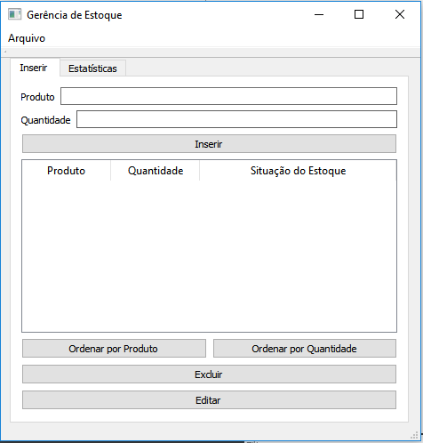

É possível visualizar uma tela de estatísticas onde teremos um resumo que informa ao usuário a quantidade total de itens do estoque, bem como a menor quantidade e também a maior. Na figura abaixo, é possível ver esta tela.

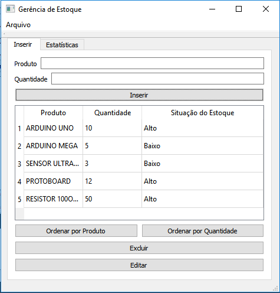

A utilização do formulário é bastante intuitiva. Observe na figura abaixo os diversos itens do formulário e a ação de sua interação com o usuário.

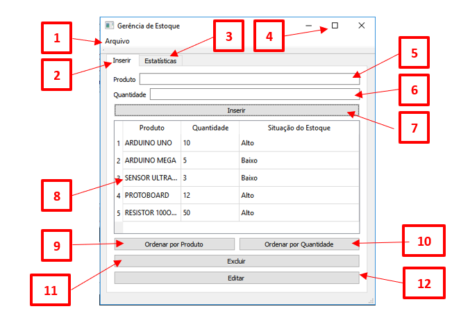

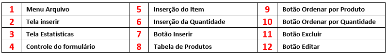

## Menu Arquivo

Neste Menu podemos acessar as opções de Salvar ou Carregar uma lista de Itens. O formato do arquivo será .txt.

## Tela Inserir

Nesta Tela faremos a inserção do Item bem como a sua quantidade. Também é possível por meio dela acessar outras funções como ordenação, Exclusão, e Edição.

## Tela Estatísticas

Nesta tela é possível ver um pequeno resumo do estoque da loja, como: Quantidade Total de Itens, Maior Quantidade e Menor Quantidade.

## Controle do Formulário

Nestas opções, podemos Fechar, Minimizar ou expandir o formulário.

## Inserção do Item

Neste Campo digitaremos o produto a ser inserido. Mesmo que a escrita seja em caixa alta ou baixa, o Item será guardado sempre em caixa alta. Não é possível inserir um item se o mesmo já foi inserido anteriormente

## Inserção da Quantidade

Neste campo digitaremos a quantidade do Item. Se a quantidade for maior que 10, o estoque do Item será classificado como alto, caso contrário, será classificado como baixo.

## Botão Inserir

Ao ser pressionado, e não havendo duplicidade, o item com sua respectiva quantidade e classificação será inserida na tabela.

## Tabela de Produtos

Este Item mostrará todos os produtos inseridos.

## Botão Ordenar por Produto

Ao Clicar neste botão, a Lista de produtos será ordenada em ordem alfabética.

## Botão Ordenar por Quantidade

Ao Clicar neste botão, a Lista de produtos será ordenada considerando a quantidade de itens de cada produto. Caso dois itens tenha a mesma quantidade, será considerada a ordenação alfabética.

## Botão Excluir

Antes de utilizar este botão, é necessário que o usuário selecione uma linha da tabela. Com isso, ao clicar no botão a linha selecionada será apagada.

## Botão Editar

Antes de utilizar este botão, é necessário que o usuário selecione uma linha da tabela. Com isso, ao clicar no botão a linha selecionada será apagada, mas o item com sua respectiva quantidade retornará ao campo de edição para que possa ser modificado e inserido novamebte na tabela.

# Inserindo Produtos na Tabela

Para Inserir produtos da tabela, basta preencher o campo Produto e o campo Quantidade e clicar no botão inserir. O Produto então será inserido na tabela juntamente com sua quantidade e a situação do estoque. Se a quantidade for igual ou superior a 10, o item será classificado como ALTO, caso contrário, será classificado como baixo. Como exemplo, vamos inserir em nossa tabela os seguintes itens:

- Arduino uno (10 peças)
- Arduino Mega (5 peças)
- Sensor Ultrassõnico (21 peças)
- Motor de Passo (3 peças)
- Drive para motor de passo (1 peça)

Ao ser inserido, nosso formulário ficará da seguinte forma:

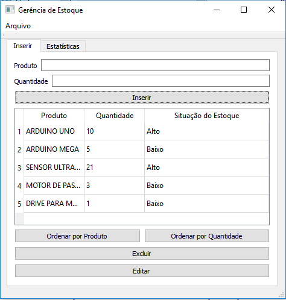

Suponha agora, que o usuário tente digitar novamente o primeiro item (Arduino Uno), como podemos ver na figura abaixo:

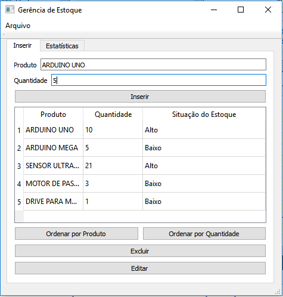

Ao clicar no botão INSERIR, uma janela de mensagem avisará da duplicidade do item.

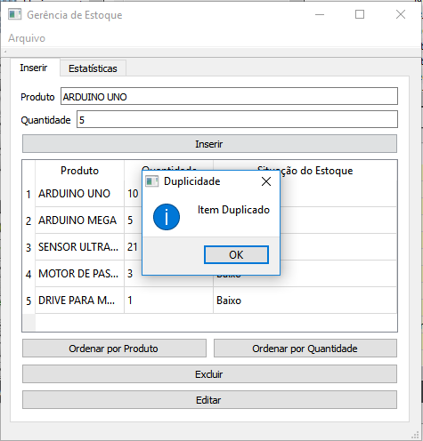

Dessa forma não será possível termos dois itens iguais cadastrados.

# Ordenando por Produto

Se o usuário desejar ordenar a lista de produtos por ordem alfabética basta clicar no botão ORDENAR POR PRODUTO. Nossa lista do exemplo dado ficará:

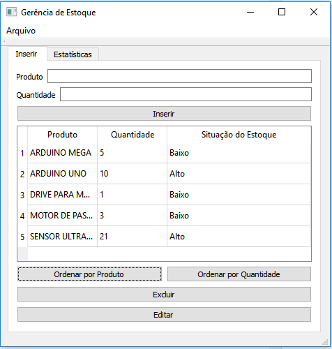

# Ordenando por Quantidade

Se o usuário desejar ordenar a lista de produtos por quantidade basta clicar no botão ORDENAR POR QUANTIDADE. Nossa lista do exemplo dado ficará:

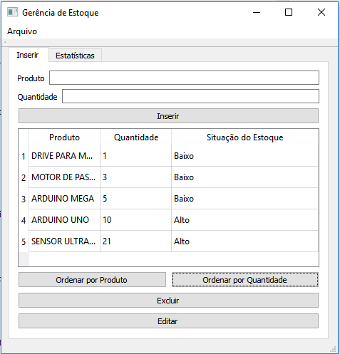

# Editando um Produto

Caso seja necessário, o usuário poderá editar o produto, basta selecionar uma linha da tabela (Observe que a linha selecionada ficará azul)e apertar no botão EDITAR. O item será apagado, mas o produto aparecerá nos campos de inserção, podendo ser editados e inseridos novamente.

Suponha que seja necessário modificar a quantidade do arduino Uno para 20 peças, neste caso, procedemos:

- Selecionamos a linha.

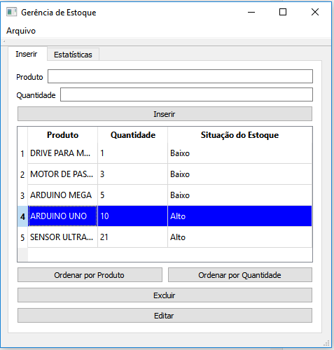

- Clicamos no botão EDITAR.

- A Linha será apagada e o item voltará aos campos de inserção.

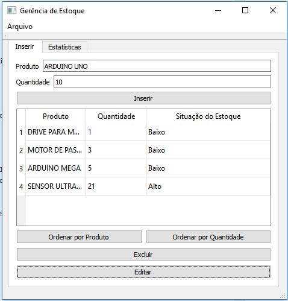

- Modificamos a quantidade para 20 e clicamos em INSERIR

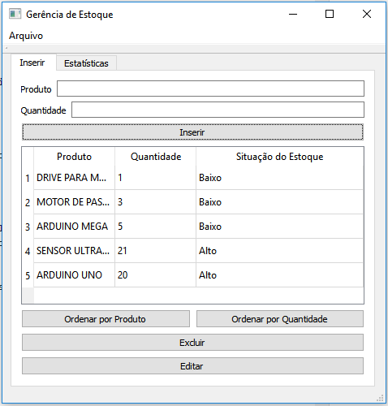

# Excluindo um Produto

Caso seja necessário, o usuário poderá excluir um produto, basta selecionar uma linha da tabela (Observe que a linha selecionada ficará azul)e apertar no botão EXCLUIR. O item será apagado.

Suponha que seja necessário excluir o item Arduino Mega:

- Selecionamos a linha.

- Clicamos no botão EXCLUIR. Uma janela de mensagem será aberta informando da excusão do item.

# Os componentes básicos do QT (basic widgets)

## Labels

Os labels estão por toda a aplicação e são os "textos" fixos da aplicação que mostram algum tipo de informação mas o usuário não pode modificar diretamente. 

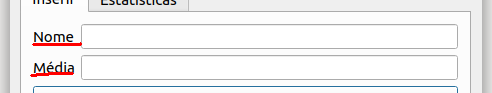

As labels são importantes pois passam informações sobre outros *widgets* ao usuário. Apesar de serem fixas para o usuário as Labels podem ter o seu texto alterado via código.

### Labels no QT Creator 

Para inserir labels no QT Creator basta estar no modo de edição da interface gráfica (basta dar um duplo clique no arquivo mainwindow.ui) procurar no lado esquerdo da tela pelos *Display Widgets* e a label será o primeiro elemento, basta então clicar e arrastar a label para a posição que você desejar na sua interface. No lado direito da tela você vai encontrar as propriedades da sua label, como o texto que ela vai exibir, o tipo de fonte usada, o tamanho da fonte e uma infinidade de outras opções. Lembre-se de sempre mudar o *objectName* do seu widget para que você possa manipular ela no código. A Figura abaixo ilustra a tela do QT Creator e onde encontrar a label e mudar o seu *objectName*.

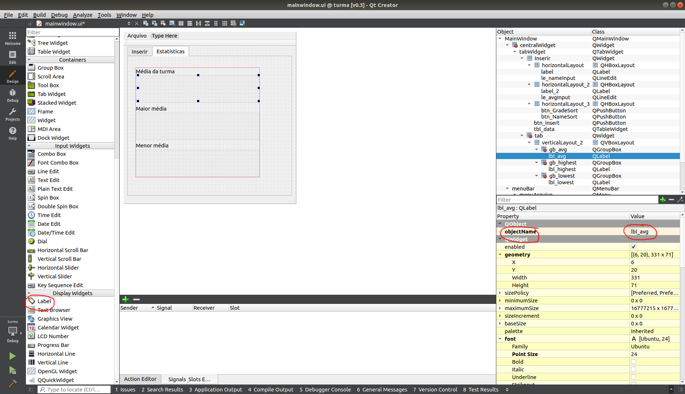

Se você criar uma label como o *objectName* de `lbl_media` por exemplo, dentro do código C++ você pode mudar o texto que ela exibe com o seguinte comando `ui->lbl_media->setText("Oi mundo");` 

### Dica

Digamos que você tenha uma váriavel `float media = 85` e deseja exibir ela através de uma label você tem que lembrar de primeiro converter ela para uma `QString` antes de passar para a sua label. Para fazer isso o QT disponibiliza dentro da classe `QString` um método estático chamado `number`para fazer conversão de números para texto. [link para documentação do QT](http://doc.qt.io/qt-5/qstring.html#number-6).

Então usando o método estático `number` da classe `QString` podemos mostrar a váriavel `media` na nossa label da seguinte forma `ui->lbl_media->setText(QString::number(media));` 

## Line Edits

Os *Line edits* são os campos editáveis de um formulário e funcionam como uma das formas de obter algum tipo de informação do usuário. Como o próprio nome diz eles só comportam um linha de texto.

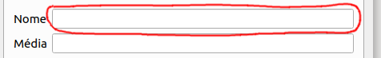

### Line Edits no QT Creator 

Os *Line edits* ficam dentro dos *Input Widgets* no QT Creator e da mesma forma que os labels basta clicar e arrastar para a posição que você desejar dentro do seu *form*. Como qualquer outro *widget* é sempre importante mudar o *objectName* para um nome que você possa facilmente referenciar dentro do seu código.

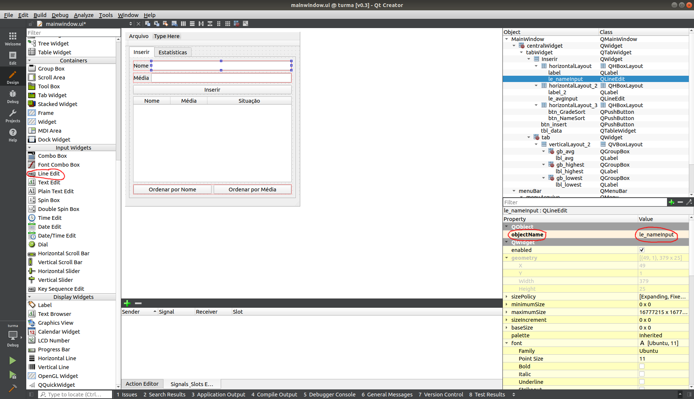

Caso você tenha criado o um *line edit* com o nome de `le_nome`, no código para acessar o conteúdo dentro que houver dentro do *line edit* basta utilizar o comando `ui->le_nome->text()`.

### Dica

Os *line edits* podem ser utilizados para obter os mais variados tipos de informações dos usuários, como nomes, idades, endereços, datas, preços, unidades e muitos outros. Por isso os *line edits* sempre consideram que o seu conteúdo é uma *QString* deixando a cargo do desenvolvedor fazer qualquer tipo de conversão de dados, felizmente dentro do QT converter uma *QString* para outros tipos de dados é bem fácil, já que a própria classe possui uma série de métodos que fazem conversão entre tipos. [Link para a documentação do QT](http://doc.qt.io/qt-5/qstring.html#toDouble). Então se você tiver um *line edit* e quiser salvar o seu conteúdo em outro tipo de váriavel que não seja uma *QString* basta fazer como algum dos exemplos abaixo:

+ `QString nome = ui->le_nome->text();` (*QString* => *QString*)
+ `int idade = ui->le_idade->text().toInt();` (*QString* => *int*)
+ `float media = ui->le_media->text().toFloat();` (*QString* => *float*)
+ `std::string rua = ui->le_endereco->text().toStdString();` (*QString* => *string* padrão do C++)
+ `QString titulo = ui->le_titulo->text().toLower();` (*QString* => *QString* minúscula)

## Push Buttons

Os *Push Buttons* são os botões mais simples no QT Creator, são muito utilizados quando o usuário quer iniciar ou completar alguma ação na interface.

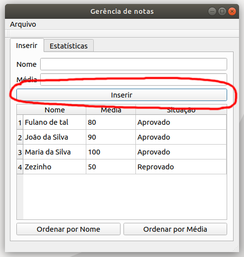

Da mesma forma que nos outros *widgets* os *push buttons* quando criados dentro do QT Creator também possuem um *objectName* que você pode e deve modificar para expressar qual é o inteção do botão na tela.

Uma das características importantes dos botões é que eles emitem _sinais_ para o QT quando são manipulados, então devemos associar esses sinais a métodos especiais que são chamados de _slots_ dentro do QT, basicamente isso significa que quando um _sinal_ é emitido para que algo aconteça é necessário ter um _slot_ associado. Por ser um ação muito comum para botões o QT Creator facilita a criação de _slots_ para os *push buttons*. Para associar as ações (_signal_) do seu botão a um método (_slot_) específico, basta clicar com o botão direito do mouse no seu *push button* e selecionar a opção *Go to slot...* no menu.

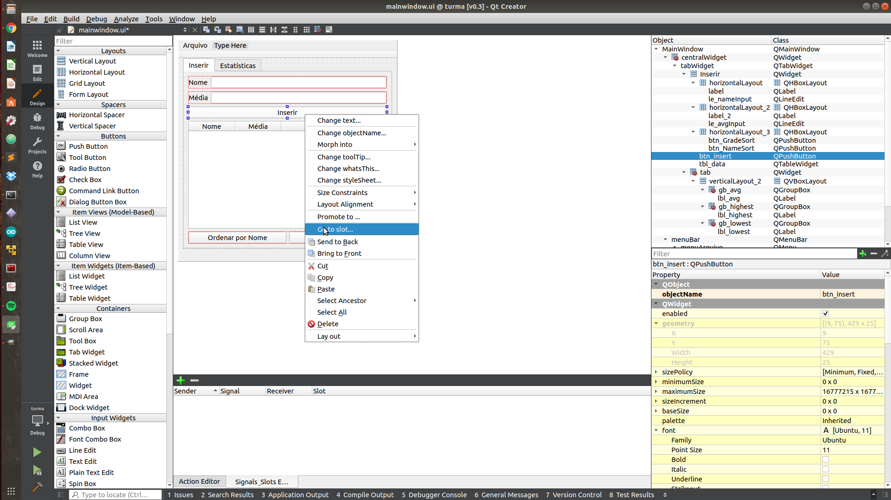

Quando você selecionar essa opção deve aparecer um menu como o da imagem abaixo com os _signals_ que o seu botão pode emitir, o mais útil para nós por enquanto é o *clicked()*.

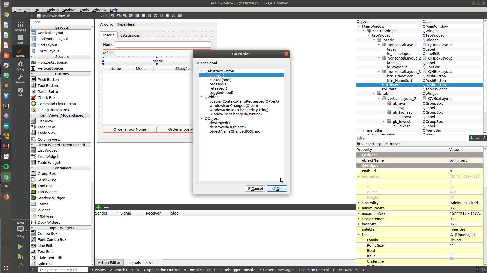

Ao escolher a opção *clicked( )* o QT Creator irá automaticamente criar um método na sua *mainWindow* para ser responsável pelo clique no seu botão.

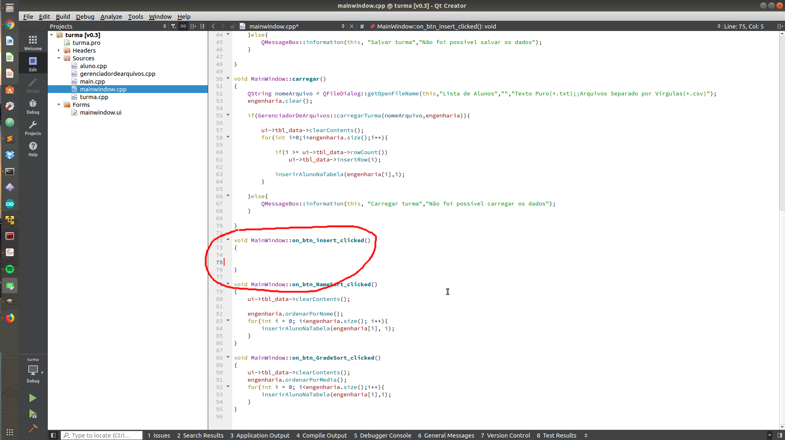

O nome do método gerado segue uma lógica bem simples, digamos que você tenha alterado o *objectName* do seu botão para *btn_inserir* então o QT Creator irá criar um método *void on_btn_inserir_clicked()* para associar ao *signal clicked* do seu botão. No método criado você pode fazer a ação que desejar, copiar um valor de um *line edit* para uma *label*, abrir uma janela nova, salvar um arquivo e etc.

